<div align="center">


<h1>Azure Virtual Desktop (AVD) Application Delivery Platform</h1>

<p><strong>Cloud-Native Desktop Virtualization & App-First Digital Workspace</strong></p>

[](https://devopstrio.co.uk/)
[](/app-packages)
[](/security)
[](/apps/autoscale-engine)

</div>

---

## 🏛️ Executive Summary

The **Azure Virtual Desktop (AVD) Application Delivery Platform** is a flagship enterprise solution designed to modernize how organizations deliver Windows applications, remote desktops, and secure workspaces at a global scale. 

By leveraging **MSIX App Attach**, **Automated Image Factories**, and **AI-driven Autoscale Engines**, this platform transfroms the complexity of VDI into a streamlined, app-first service. Whether supporting high-end CAD engineering workstations, isolated contractor environments, or global call center multi-session desktops, the platform ensures maximum performance, security, and cost-efficiency.

### Strategic Business Outcomes
- **Global Workforce Enablement**: Instantly provision secure workspaces for employees and contractors anywhere in the world with sub-second app delivery.
- **Cost Optimization**: Reduce Azure compute costs by up to 60% through intelligent session-density autoscaling and scheduled shutdown workflows.
- **Zero-Trust Delivery**: Establish granular Conditional Access policies, ensuring that sensitive regulated workloads are only accessible from compliant devices.
- **Image Lifecycle Management**: Eliminate "image bloat" with a centralized image factory that automates patching, sysprepping, and distribution to global regions.

---

## 🏗️ Technical Architecture Details

### 1. High-Level Enterprise Architecture
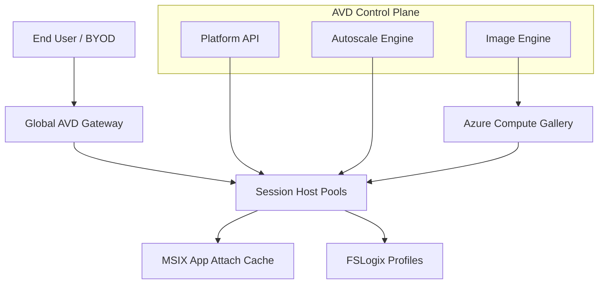

### 2. User Login & Workspace Lifecycle
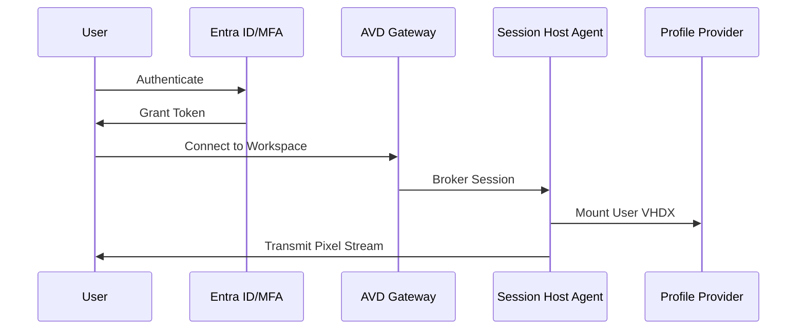

### 3. Application Publishing Lifecycle
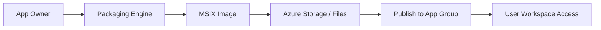

### 4. Golden Image Pipeline (Packer + Bicep)
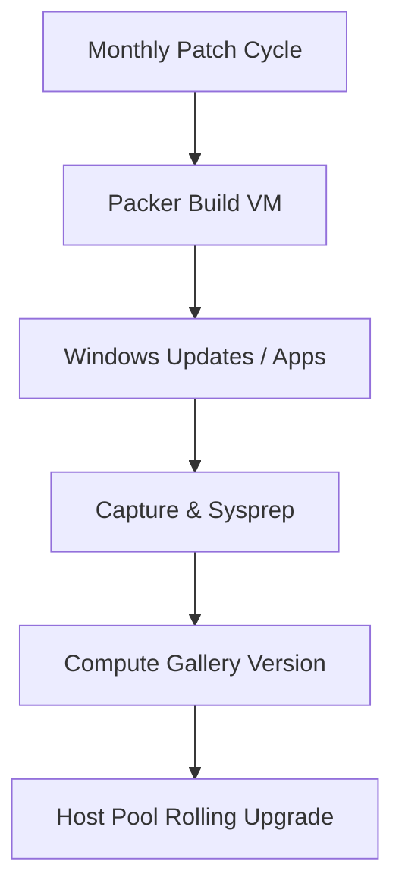

### 5. Autoscale Decision Logic
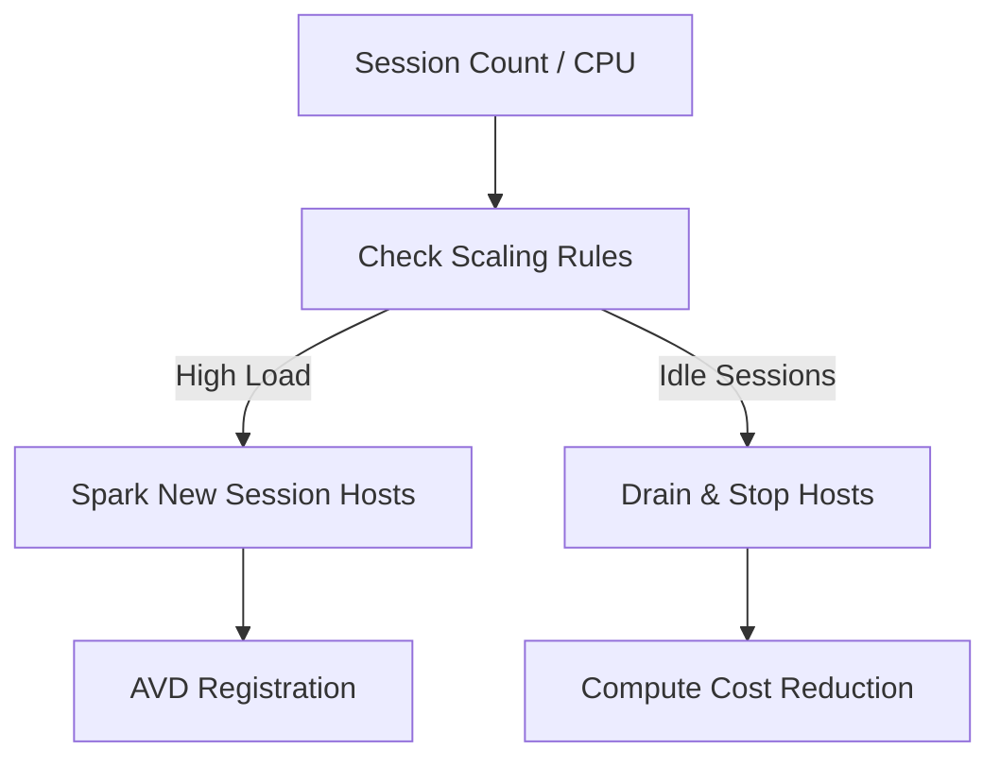

### 6. Security Trust Boundary
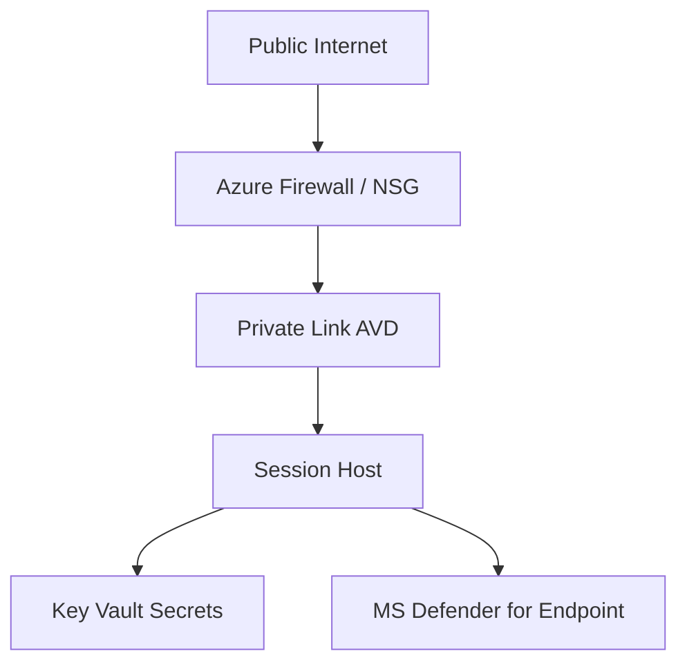

### 7. Global Hub-Spoke Topology
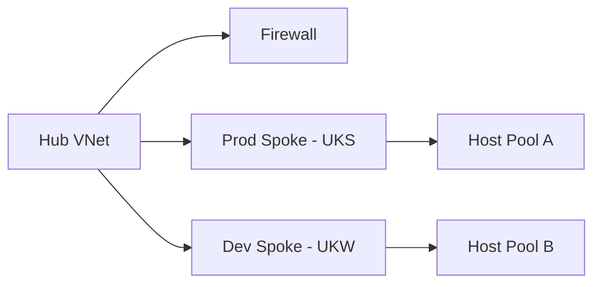

### 8. API Request Lifecycle
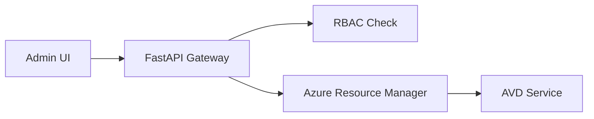

### 9. MSIX App Attach Mounting Workflow
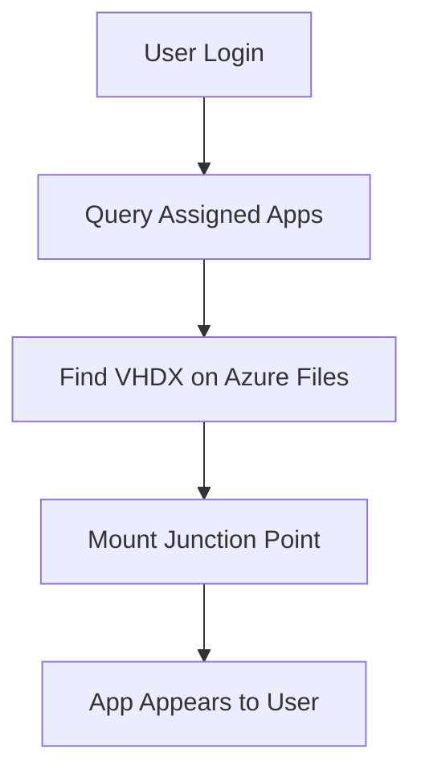

### 10. Multi-Tenant Resource Isolation
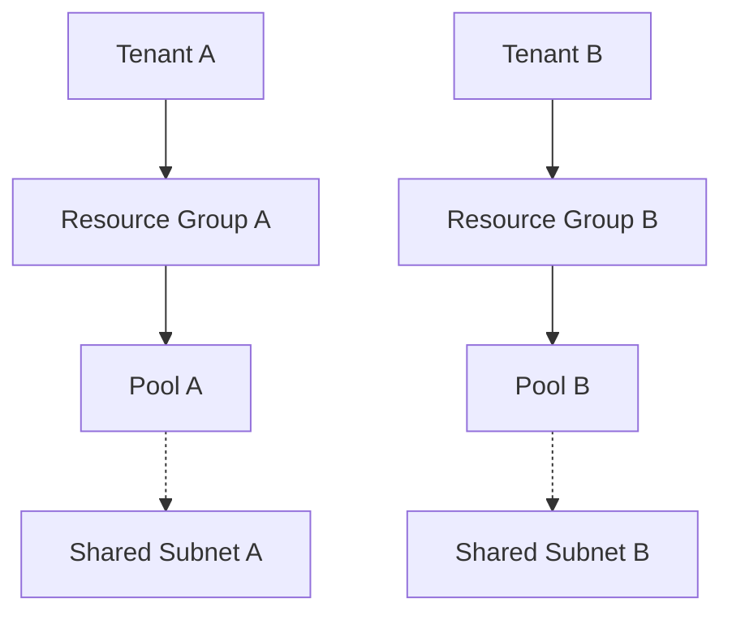

### 11. Monitoring & Telemetry Flow
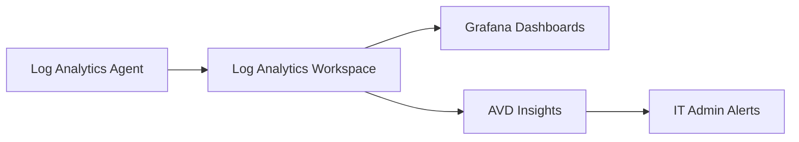

### 12. Disaster Recovery Topology
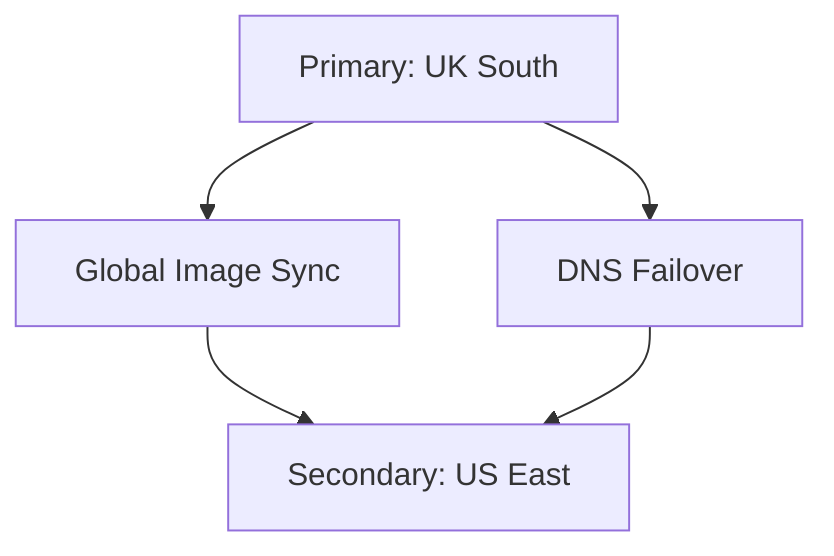

### 13. Contractor Isolated Access Flow
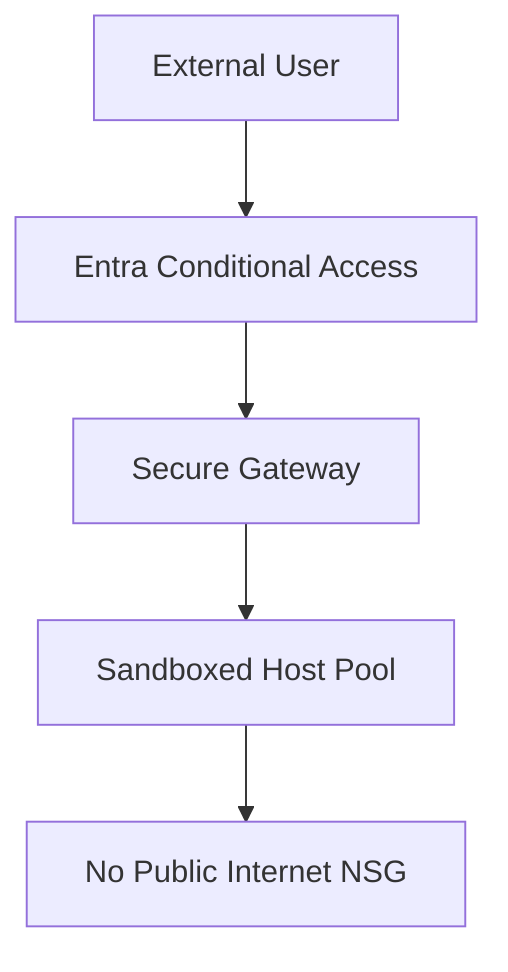

### 14. GPU Workstation Rendering Model
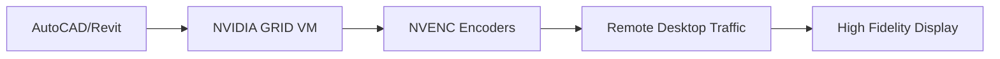

### 15. Cost Optimization Workflow
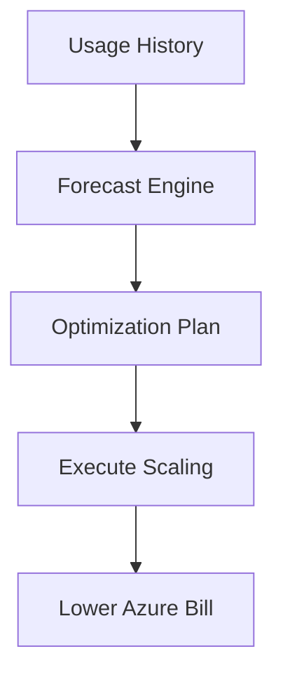

### 16. Image Versioning & Rollback
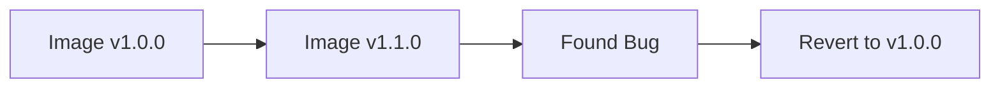

### 17. Host Pool Scaling Model
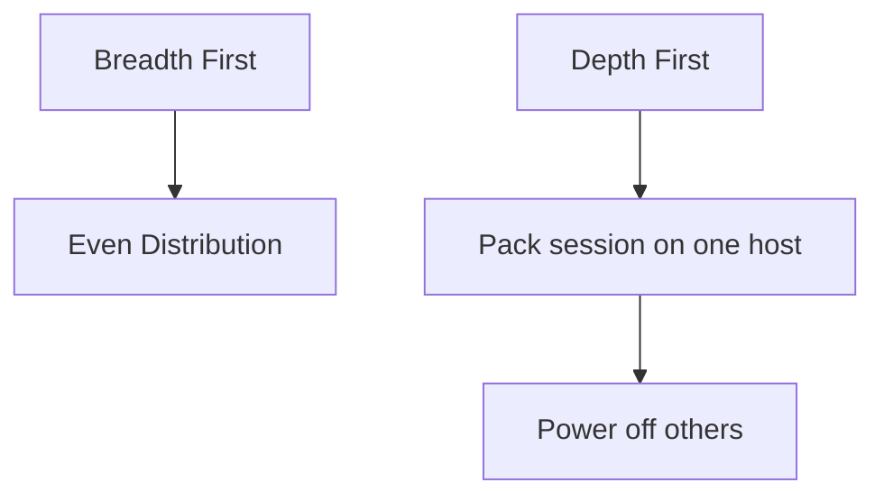

### 18. CI/CD Operations Pipeline
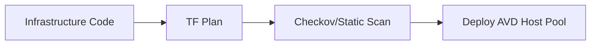

### 19. Identity Federation Architecture
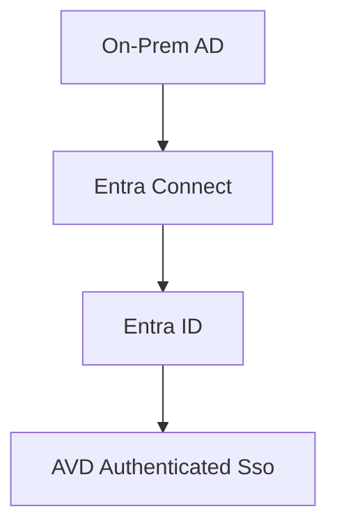

### 20. Executive Governance Workflow
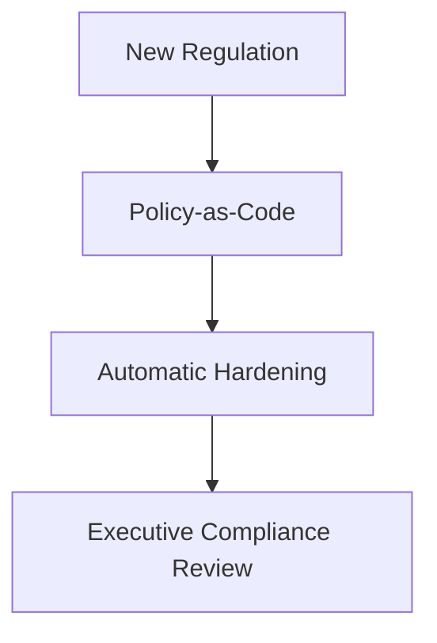

---

## 🛠️ Global Platform Components

| Engine | Directory | Purpose |
|:---|:---|:---|
| **AVD Portal** | `apps/portal/` | Executive Next.js interface for managing remote sessions and host pools. |
| **Workspace Engine**| `apps/workspace-engine/` | Logic for provisioning host pools, workspaces, and application groups. |
| **Autoscale Engine** | `apps/autoscale-engine/` | Python-driven agent that manages VM power states based on user density. |
| **Image Engine** | `apps/image-engine/` | Automation of Azure Compute Gallery and golden image versions. |

---

## 🚀 Environment Deployment

Deploy the infrastructure.

```bash
cd terraform/environments/prod
terraform init
terraform apply -auto-approve
```

---
<sub>&copy; 2026 Devopstrio &mdash; Redefining the Digital Workplace.</sub>
